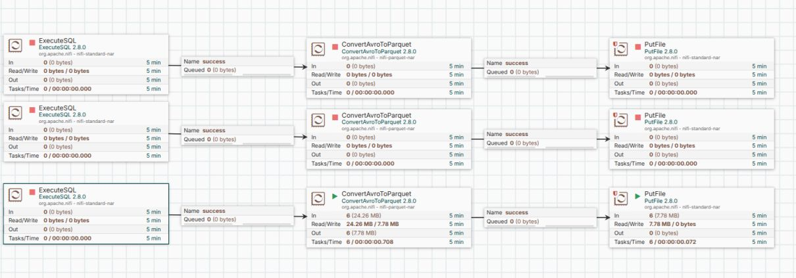
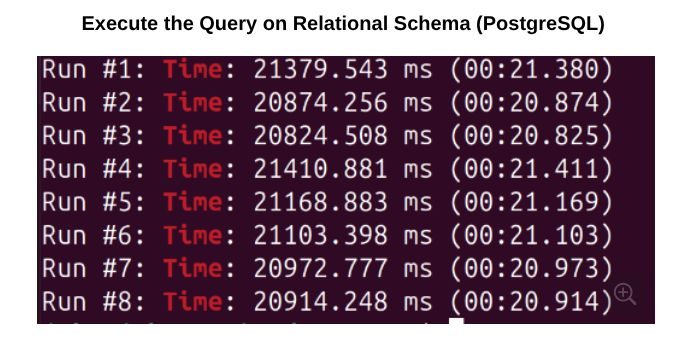
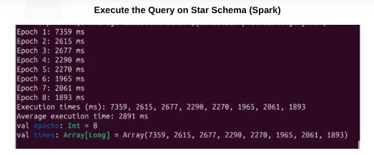
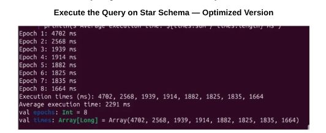

# OLAP ETL Pipeline

## 📝 Project Overview
This project implements a complete ETL pipeline to migrate a normalized **TPC-H dataset (SF=1)** from a relational MySQL (OLTP) source to an optimized **Star Schema (OLAP)**. By denormalizing the data and using columnar storage (Parquet), we achieved significant performance gains for analytical queries.

### 🚀 Performance Summary
| Schema Version | Engine | Average Execution Time |
| :--- | :--- | :--- |
| **Original 3NF** | PostgreSQL  | **21.07 seconds** |
| **Star Schema** | Apache Spark | **2.89 seconds** |
| **Optimized Star Schema** | Apache Spark | **2.29 seconds** |

---

## 🏗️ ETL Architecture (Apache NiFi)
We utilized **Apache NiFi 2.2.0** to orchestrate the data flow. The pipeline extracts data using `GenerateTableFetch` and `ExecuteSQL`, transforms the relational joins "in-flight," and persists the results as Parquet files.

### NiFi Processing Graph

*Figure 1: The complete NiFi computational graph showing the extraction and transformation logic.*

---

## 📊 Benchmarking & Results

### PostgreSQL Execution
We performed 8 runs to calculate the baseline average for the original relational schema.

### OLAP Performance (Star Schema)
Initial migration to a Star Schema significantly reduced join depth, leading to faster aggregations.

### Star Schema Optimization
By refining the join logic (removing the redundant nation join), we achieved the peak performance of **2.29s**.

---

## 📂 Repository Structure
* `src/sql/`: Contains both OLTP and OLAP DDL and retrieval queries.
* `src/nifi/`: Contains the exported NiFi flow definition.
* `src/spark/`: Contains the Scala/Spark scripts used for benchmarking.
* `images/`: contains the screenshots for the ETL process and results.
